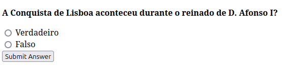
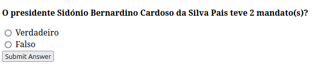
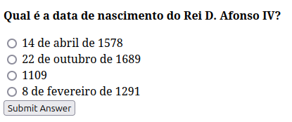
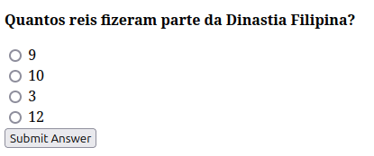
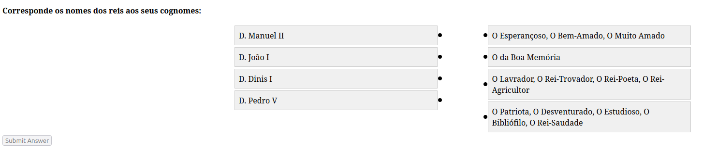
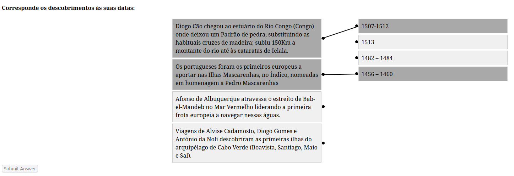

# TPC3: Fazer um Quiz com base no dataset sobre a História de Portugal

## Questões

Cada questão tem várias versões geradas a partir do dataset sobre a História de Portugal.

### V/F

1. A [Nome do Acontecimento] aconteceu durante o reinado de [Nome do Rei]?
   
    Exemplo:

    

1. O presidente [Nome do Presidente] teve [Número de Mandatos] mandato(s)?
   
    Exemplo:

    

### Escolha Múltipla

1. **Qual é a data de nascimento do Rei [Nome do Rei]?**

    Exemplo:

    

2. **Quantos reis fizeram parte da [Nome da Dinastia]?**

    Exemplo:

    

### Correspondência

1. **Corresponde os nomes dos seguintes reis aos seus cognomes:**

    Exemplo:

    

2. **Corresponde os seguintes descobrimentos às suas datas:**

    Exemplo:

    